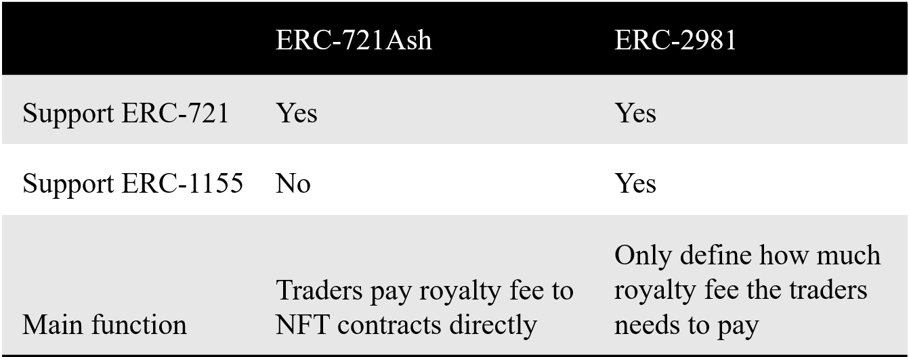

<!-- PROJECT LOGO -->
<a name="readme-top"></a>
# ERC-721Æ (ERC-721Ash) [![MIT License][license-shield]][license-url]
Open Source NFT Royalty Fee Standard Based on ERC-721 Standard <br />
> _This is Beta Version. I'll be adding more in the near future. You may also suggest changes by forking this repo and creating a pull request or opening an issue. ERC-721Ash is based on ERC-721A, [Please refer to the documentation for more details.](https://chiru-labs.github.io/ERC721A/#/erc721a)_

<div align="center">
  <a href="https://github.com/ERC721Ash/ERC721Ash">
    
  </a>
</div>

<!-- ABOUT THE PROJECT -->
## About The Project

ERC-721Ash is an improved implementation of the IERC721 standard that supports trading tokens for charge royalty fee.

Here's why:
* Against the zero royalty fee NFT marketplace, such as: X2Y2
* Disruptive Innovation - Revenue Stream, Controlled Liquidity ...
* More ...

<p align="right">(<a href="#readme-top">back to top</a>)</p>

## ERC-721Ash v.s. [ERC-2981](https://eips.ethereum.org/EIPS/eip-2981)

<div align="center">
  <a href="https://github.com/ERC721Ash/ERC721Ash">
    
  </a>
</div>

<p align="right">(<a href="#readme-top">back to top</a>)</p>

<!-- GETTING STARTED -->
## Getting Started

### Clone the repo
   ```sh
   git clone https://github.com/ERC721Ash/ERC721Ash.git
   ```

### Usage

   ```solidity
pragma solidity ^0.8.4;
import "ERC721Ash/contracts/ERC721Ash.sol";
import "@openzeppelin/contracts/access/Ownable.sol";

contract Example is Ownable, ERC721Ash {
    devAddr = msg.sender;
    constructor() ERC721A("Example", "EXP") { devAddr = msg.sender; }

    function mint(uint256 quantity) external payable {
        // `_mint`'s second argument now takes in a `quantity`, not a `tokenId`.
        _mint(msg.sender, quantity);
    }

    function purchaseTicket(uint256 quantity) external payable callerIsUser {
        require(quantity > 0, "Cannot buy 0 tickets");
        require(_ticketPrice > 0, "Ticket price is not set");
        require(_ticketPrice * quantity <= msg.value, "Not enough Ether to buy tickets");

        (bool purchaseSuccess, ) = devAddr.call{value: msg.value}("");
        require(purchaseSuccess, "Purchase failed");
        _purchaseTicket(quantity);
    }

    function setupTicketPrice(uint256 ticketPriceWei) public onlyOwner {
        _ticketPrice = ticketPriceWei;
    }
}
```

<p align="right">(<a href="#readme-top">back to top</a>)</p>

<!-- USAGE EXAMPLES -->
## Usage Example

Please refer to [example contract](https://github.com/ERC721Ash/ERC721Ash/tree/main/example).

<p align="right">(<a href="#readme-top">back to top</a>)</p>

<!-- ROADMAP -->
## Roadmap

- [x] Release Beta Version
- [x] Testing Stages
- [ ] Release Alpha Version
- [ ] Improve general repo and code quality (workflows, comments, etc.)
- [ ] Add more documentation on benefits of using ERC721Ash
- [ ] Maintain full test coverage
- [ ] Apply for EIP standard
- [ ] Documentation
    - [x] English
    - [ ] Chinese
    - [ ] Japanese
    - [ ] Others

<p align="right">(<a href="#readme-top">back to top</a>)</p>

<!-- CONTRIBUTING -->
## Contributing

Contributions are what make the open source community such an amazing place to learn, inspire, and create. Any contributions you make are **greatly appreciated**.

If you have a suggestion that would make this better, please fork the repo and create a pull request. You can also simply open an issue with the tag "enhancement".
Don't forget to give the project a star! Thanks again!

1. Fork the Project
2. Create your Feature Branch (`git checkout -b feature/AmazingFeature`)
3. Commit your Changes (`git commit -m 'Add some AmazingFeature'`)
4. Push to the Branch (`git push origin feature/AmazingFeature`)
5. Open a Pull Request

<p align="right">(<a href="#readme-top">back to top</a>)</p>


<!-- LICENSE -->
## License

Distributed under the MIT License. See `LICENSE` for more information.

<p align="right">(<a href="#readme-top">back to top</a>)</p>


<!-- CONTACT -->
## Contact

Darren K.J. Chen | 
E-mail: kjchen@protonmail.ch
<br />Project Link: [https://github.com/ERC721Ash/ERC721Ash](https://github.com/ERC721Ash/ERC721Ash)

<p align="right">(<a href="#readme-top">back to top</a>)</p>

<!-- ACKNOWLEDGMENTS -->
<!-- ## Acknowledgments -->

<!-- Use this space to list resources you find helpful and would like to give credit to. I've included a few of my favorites to kick things off!

* [Choose an Open Source License](https://choosealicense.com)
* [GitHub Emoji Cheat Sheet](https://www.webpagefx.com/tools/emoji-cheat-sheet)
* [Malven's Flexbox Cheatsheet](https://flexbox.malven.co/)
* [Malven's Grid Cheatsheet](https://grid.malven.co/)
* [Img Shields](https://shields.io)
* [GitHub Pages](https://pages.github.com)
* [Font Awesome](https://fontawesome.com)
* [React Icons](https://react-icons.github.io/react-icons/search) -->

<!-- <p align="right">(<a href="#readme-top">back to top</a>)</p> -->


<!-- MARKDOWN LINKS & IMAGES -->
<!-- https://www.markdownguide.org/basic-syntax/#reference-style-links -->
[contributors-shield]: https://img.shields.io/github/contributors/othneildrew/Best-README-Template.svg?style=for-the-badge
[contributors-url]: https://github.com/othneildrew/Best-README-Template/graphs/contributors
[forks-shield]: https://img.shields.io/github/forks/othneildrew/Best-README-Template.svg?style=for-the-badge
[forks-url]: https://github.com/othneildrew/Best-README-Template/network/members
[stars-shield]: https://img.shields.io/github/stars/othneildrew/Best-README-Template.svg?style=for-the-badge
[stars-url]: https://github.com/othneildrew/Best-README-Template/stargazers
[issues-shield]: https://img.shields.io/github/issues/othneildrew/Best-README-Template.svg?style=for-the-badge
[issues-url]: https://github.com/othneildrew/Best-README-Template/issues
[license-shield]: https://img.shields.io/github/license/othneildrew/Best-README-Template.svg?style=for-the-badge
[license-url]: https://github.com/othneildrew/Best-README-Template/blob/master/LICENSE.txt
[linkedin-shield]: https://img.shields.io/badge/-LinkedIn-black.svg?style=for-the-badge&logo=linkedin&colorB=555
[linkedin-url]: https://linkedin.com/in/othneildrew
[product-screenshot]: images/screenshot.png
[Next.js]: https://img.shields.io/badge/next.js-000000?style=for-the-badge&logo=nextdotjs&logoColor=white
[Next-url]: https://nextjs.org/
[React.js]: https://img.shields.io/badge/React-20232A?style=for-the-badge&logo=react&logoColor=61DAFB
[React-url]: https://reactjs.org/
[Vue.js]: https://img.shields.io/badge/Vue.js-35495E?style=for-the-badge&logo=vuedotjs&logoColor=4FC08D
[Vue-url]: https://vuejs.org/
[Angular.io]: https://img.shields.io/badge/Angular-DD0031?style=for-the-badge&logo=angular&logoColor=white
[Angular-url]: https://angular.io/
[Svelte.dev]: https://img.shields.io/badge/Svelte-4A4A55?style=for-the-badge&logo=svelte&logoColor=FF3E00
[Svelte-url]: https://svelte.dev/
[Laravel.com]: https://img.shields.io/badge/Laravel-FF2D20?style=for-the-badge&logo=laravel&logoColor=white
[Laravel-url]: https://laravel.com
[Bootstrap.com]: https://img.shields.io/badge/Bootstrap-563D7C?style=for-the-badge&logo=bootstrap&logoColor=white
[Bootstrap-url]: https://getbootstrap.com
[JQuery.com]: https://img.shields.io/badge/jQuery-0769AD?style=for-the-badge&logo=jquery&logoColor=white
[JQuery-url]: https://jquery.com 
